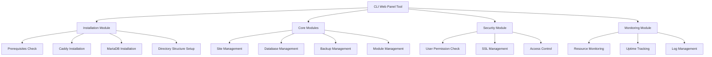

# CLI Web Panel Installer
webpanel adalah tool untuk mengelola server atau vps menggunakan cli atau terminal, dirancang untuk pengguna dengan pengalaman sysadmin yang minim.

## Arsitektur Sistem



## Persyaratan Sistem
- Sistem operasi: Linux (Ubuntu/Debian direkomendasikan)
- RAM minimal: 1GB
- Disk space minimal: 20GB
- Tidak bisa dijalankan sebagai user root (keamanan)
- Koneksi internet untuk instalasi

## Instalasi
```bash
curl -sSL https://get.webpanel.tool | bash
```
Script ini akan:
1. Memeriksa persyaratan sistem
2. Menginstall Caddy server
3. Menginstall MariaDB
4. Mengkonfigurasi struktur direktori
5. Mengatur permission dan keamanan dasar

## Web Server
Menggunakan **Caddy** dengan beberapa modul konfigurasi yang secara default tersedia:
- **php** (PHP FastCGI)
- **spa** (Single Page Application)
- **security** (Keamanan dasar)
- **header** (Manajemen header)
- **restrict access** (Akses terbatas dengan argumen IP)

## Database
Menggunakan **MariaDB** sebagai database server.

## Struktur Direktori
```
/usr/local/webpanel/
├── bin/
│   └── webpanel             # Main executable
├── lib/
│   ├── core/                # Core functionality
│   ├── commands/            # Command implementations
│   ├── modules/             # Loadable modules
│   └── utils/               # Helper functions
├── config/
│   ├── global/             # Global configurations
│   └── sites/              # Site-specific configs
└── logs/                   # Application logs
```

## Struktur Konfigurasi
- **Config Caddy Global**: Konfigurasi yang berlaku untuk semua situs.
- **Config Caddy Site**: Konfigurasi yang berlaku untuk masing-masing situs.

## Perintah CLI

### Manajemen Sistem
```bash
# Melihat status sistem
webpanel status
```
Menampilkan informasi tentang:
- CPU usage
- Memory usage
- Disk space
- Network statistics
- Uptime
- Service status

```bash
# Melihat log sistem
webpanel logs [--service=caddy|mariadb|webpanel]
```
Menampilkan log dari service yang dipilih.

### Manajemen Situs
```bash
webpanel site add domain.com
```
Membuat web directory `/apps/sites/domain.com` dan konfigurasi terkait.

```bash
webpanel site list
```
Menampilkan daftar situs yang ada.

```bash
webpanel site rm domain.com
```
Menghapus direktori dan konfigurasi situs dengan konfirmasi terlebih dahulu.

### Manajemen Modul
```bash
webpanel module list-available
```
Menampilkan daftar modul global yang tersedia.

```bash
webpanel module list domain.com
```
Menampilkan daftar modul yang terpasang pada `domain.com`.

```bash
webpanel module add module_name domain.com
```
Menambahkan modul ke `domain.com`.

```bash
webpanel module rm module_name domain.com
```
Menghapus modul dari `domain.com`.

### Manajemen Backup
```bash
webpanel backup enable daily domain.com
```
Mengaktifkan backup harian dengan metode incremental untuk `domain.com`.

```bash
webpanel backup enable weekly domain.com
```
Mengaktifkan backup mingguan dengan metode full backup untuk `domain.com`.

```bash
webpanel backup disable daily domain.com
```
Menonaktifkan backup harian untuk `domain.com`.

```bash
webpanel backup disable weekly domain.com
```
Menonaktifkan backup mingguan untuk `domain.com`.

### Manajemen Database
```bash
webpanel db list
```
Menampilkan daftar database yang ada.

```bash
webpanel db create dbname
```
Membuat database baru dengan nama `dbname`.

```bash
webpanel db delete dbname
```
Menghapus database `dbname`.

### Manajemen Pengguna Database
```bash
webpanel dbuser list
```
Menampilkan daftar pengguna database.

```bash
webpanel dbuser create username password
```
Membuat pengguna database baru dengan username dan password.

```bash
webpanel dbuser delete username
```
Menghapus pengguna database.

### Manajemen Hak Akses Database
```bash
webpanel dbgrant username dbname
```
Memberikan akses pengguna `username` ke database `dbname`.

### Manajemen Backup Database
```bash
webpanel dbbackup enable daily dbname
```
Mengaktifkan backup harian database `dbname`.

```bash
webpanel dbbackup enable weekly dbname
```
Mengaktifkan backup mingguan database `dbname`.

```bash
webpanel dbbackup disable daily dbname
```
Menonaktifkan backup harian database `dbname`.

```bash
webpanel dbbackup disable weekly dbname
```
Menonaktifkan backup mingguan database `dbname`.

## Struktur Direktori Backup
```
/backup/
   ├── daily/
   │   ├── domain.com/
   │   │   ├── 2025-03-09.tar.gz
   │   │   ├── 2025-03-08.tar.gz
   │   │   ├── ...
   │   ├── dbname/
   │   │   ├── 2025-03-09.sql.gz
   │   │   ├── 2025-03-08.sql.gz
   │   │   ├── ...
   ├── weekly/
   │   ├── domain.com/
   │   │   ├── 2025-03-03-full.tar.gz
   │   │   ├── 2025-02-24-full.tar.gz
   │   │   ├── ...
   │   ├── dbname/
   │   │   ├── 2025-03-03-full.sql.gz
   │   │   ├── 2025-02-24-full.sql.gz
   │   │   ├── ...
```

## Keamanan
1. Verifikasi permission user (tidak boleh root)
2. Manajemen SSL/TLS otomatis
3. Firewall configuration
4. Enkripsi backup
5. Secure configuration storage

## Error Handling
- Pesan error yang detail dan mudah dipahami
- Saran penyelesaian masalah
- Logging otomatis
- Prosedur recovery

## Monitoring
- CPU usage
- Memory usage
- Disk space
- Network statistics
- Service status
- Error rate
- Performance metrics
